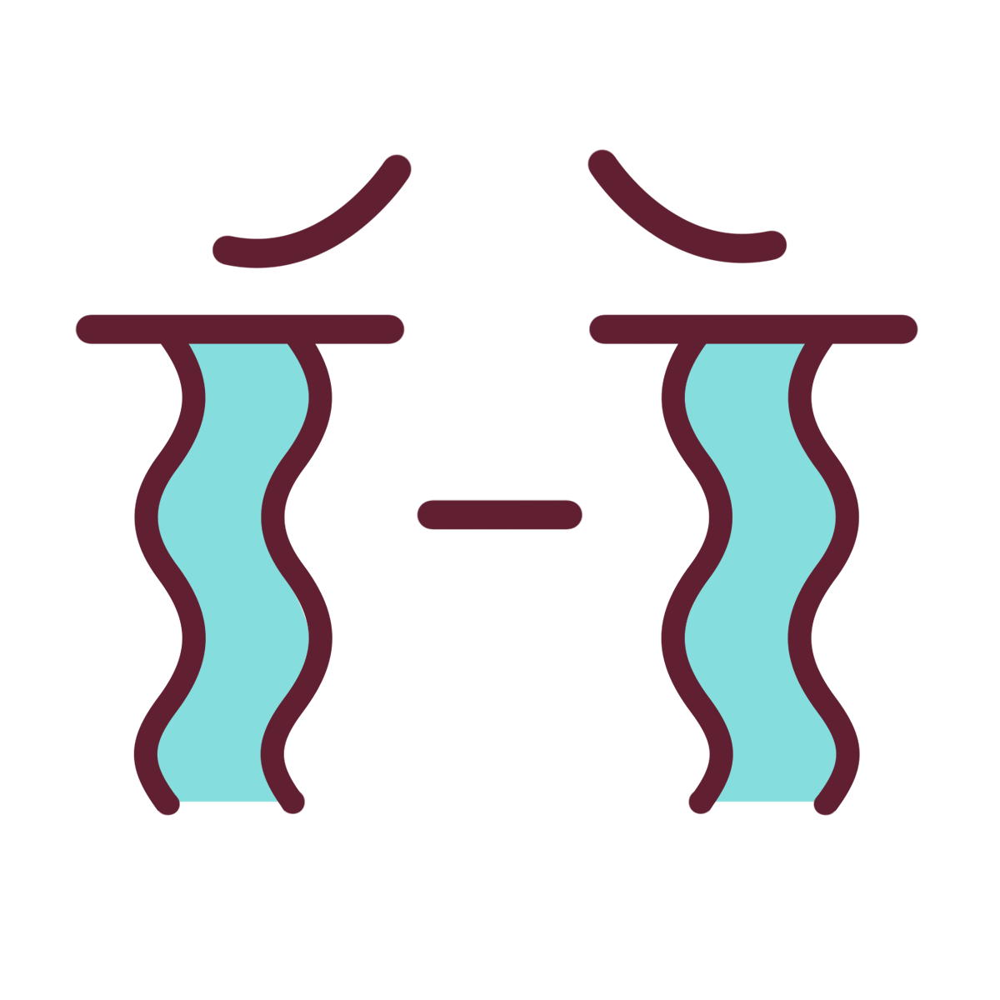

# 행복펜션 포트폴리오

팀 과제 : 박효준, 이소윤, 김효정, 장경선

## 목차

- [행복펜션 포트폴리오](#행복펜션-포트폴리오)
  - [목차](#목차)
  - [링크](#링크)
  - [스크린샷](#스크린샷)
    - [시안](#시안)
    - [데스크탑](#데스크탑)
    - [모바일](#모바일)
  - [작업내용](#작업내용)
    - [사용 스킬](#사용-스킬)
    - [공부](#공부)
  - [리뉴얼 전 작품](#리뉴얼-전-작품)

## 링크

- [LiveSite](https://hyojuns.github.io/Rentalcottage-project/)
## 스크린샷

### 시안

- 파일이 없다.

### 데스크탑

- 파일이 없다.

### 모바일

- 파일이 없다.

## 작업내용

### 사용 스킬

- HTML 5
- CSS
  - Grid
  - Flex
- JavaSCript
- Jquery
- GASP

### 공부

- 많은 걸 배울 것이다.

## 리뉴얼 전 작품
[접속하기](http://www.gphappy.kr/)